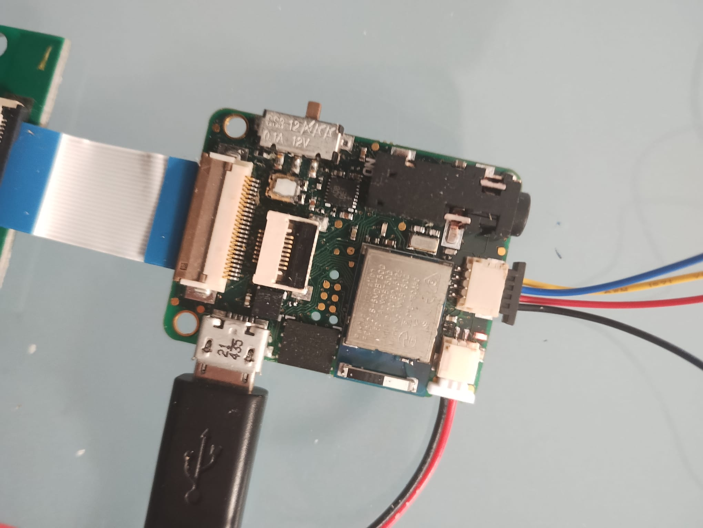
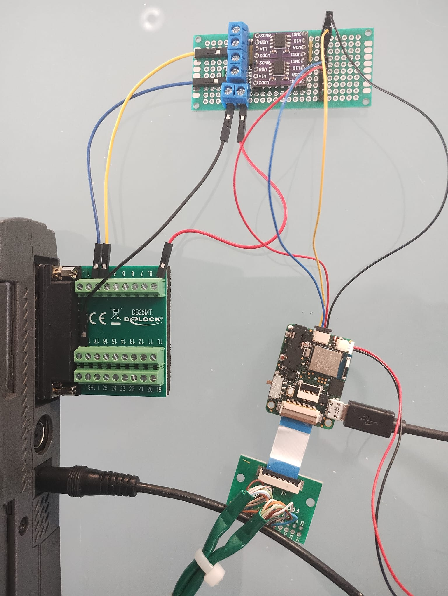

# Usage

## Settings

The default settings are defined in [Settings.hpp](../VHP-Vibro-Glove2/Settings.hpp). They can be modified to change the startup behaviour of the software. Please refer to the file for more details.

## WebUI

The software can be controlled with a browser supporting Bluetooth Web API (see below).

After starting the device will activate its Bluetooth connection, and start accepting connections. Note that the Bluetooth interface will deactivate after 5mins of inactivity.

Open *f2heal_webui_v2.html*  found in [WebUI folder](../webui) in a browser to use this feature. 

Use the **connect** button to connect to a device.

### Browsers

#### Chrome

Successfully tested with Chrome. It might be necessary to enable experimental features by setting the 'enable-experimental-web-platform-features' flag to enabled.

Change this in your browser by going to: 

     chrome://flags/#enable-experimental-web-platform-features

#### BlueFy

On Apple devices the [BlueFy](https://apps.apple.com/us/app/bluefy-web-ble-browser/id1492822055) Web Browser can also be used

## TTL Trigger

In the current setup a TTL trigger can be used to start and stop the device. This can be used for EEG measurement or an extra on-off switch.

### Qwiic connector

The onboard Qwiic connector is used to control the TTL Trigger. In the image below, the Qwiic connector is connected with the black-blue-yellow-red cable:

The pins used are defined in [BoardDefs.hpp](../VHP-Vibro-Glove2/src/BoardDefs.hpp). Refer to [this image](img/AdaFruit-nRF52840.jpg) to translate between the nRF and Arduino pins. 

### Test with Digital Coupler

In the setup below, the TTL is triggered with a parallel port that is connected to a [digital coupler](http://www.analog.com/ADuM1201?doc=ADuM1200_1201.pdf). The TTL can be triggered with a digital input from the coupler. The coupler is connected with the VHP board via the Qwiic connector.

In the setup above:

* The LPT Port has 25 pins
* Pin 18 is used as ground connected with a black wire.
* Pin 9, being Digital output 7 is made permanently high at 5V as power supply for the digital coupler. Being the red wire.
* Pin 2, being Digital output 0 is used as stop Signal. Switching it from logical 0 to logical one generates a rising edge, being the stop Signal.
* Pin 3, being Digital output 1 is used as start Signal. Switching it from logical 0 to logical one generates a rising edge, being the start Signal.

## Internals

The software will produce a waveform in a random sequence on the different channels according to the settings passed to **SStream**.

These parameters are defined and documented in [SStream.hpp](VHP-Vibro-Glove2/SStream.hpp) and illustrated below.

 The default settings in [Settings.hpp](../VHP-Vibro-Glove2/Settings.hpp) provide with a balanced default:
 
 * 8 channels
 * Samplerate 46875Hz, long story, tied to SetUpsamplingFactor(1), only touch it if you know what you're doing ;-)
 * Stimulation frequency 250Hz

      * This means that one stimulation sine cycle takes  46875Hz / 250Hz = 187.5 samples
 * Stimulation duration 100ms
      * This means that one stimulation period takes 4687.5 samples

* Cycle period 1332ms. This leaves 1332ms / 8  = 166.5ms as a maximum for stimulation duration. With a stimulation duration of 100ms this leaves 166.5 - 100 = 66.5ms of silence before the next channel starts

* Pauze-cyle period 5 & Pauzed cycles 2 : For every 5 cycles 2 will be pauzed, total silence on all channels. So on 5 * 1332ms = 6660ms there will 2 * 1332ms = 2664ms of silence
* Jitter 23.5% : This is 23.5% of 1332ms / 8 or 39.1ms, so well below the 66.5ms of silence calculated above

**Warning:** Not all settings make sense. The [settings2.ods](settings2.ods) spreadsheet can be used to verify your settings.

Current used settings preset :

